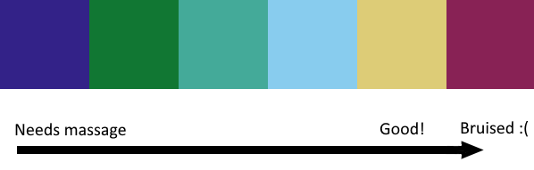

# AccessibleOrc

Accessibility features for Orc Massage

## Color vision deficiency

Replace the color of some UI elements with a color palette that is more
distinguishable for people with colorblindness.

The default colors compared to the modded colors can be seen below.

### Using a custom color palette

If the modded color palette is not suitable to you, you may wish to use your own palette.
This can be accomplished by creating a 6x1 pixel image using an image editor of your choice (e.g. Aseprite, Photoshop, MS paint).

The colors are in order, left to right, the progress of a massage. The leftmost color represents a spot that requires the most massaging,
the second-to-rightmost represents the "good!" massage spot, and the rightmost color is when a spot is bruised, or over-massaged.

1. Create a 6x1 pixel image
2. Use the pencil tool to choose your colors
3. Save the image to "`<game_directory>/BepInEx/Plugins/AccessibleOrc/Palettes/Custom.png`"

