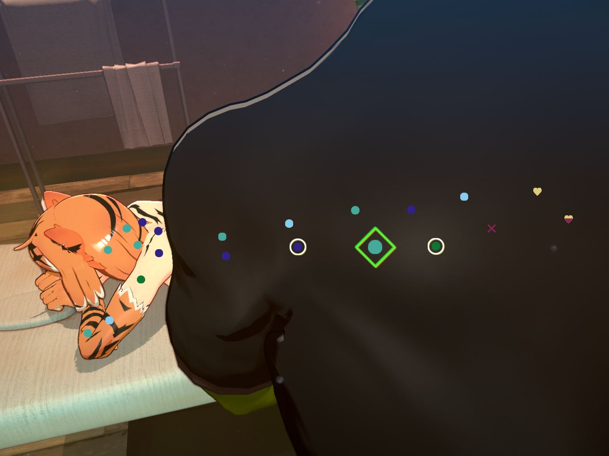

# AccessibleOrc

Replaces the color of some UI elements with a color palette that is more distinguishable for people with colorblindness.

We consulted two people with color vision deficiency. The modded color palette is optimized for Protanopia and should also work for Deuteranopia and Tritanopia. 

If you would like any other accessibility features added to this mod, create an Issue or message me on Discord (@pineapler).

## Installation

* Install using Vortex Mod Manager ([link to NexusMods page](https://www.nexusmods.com/orcmassage/mods/2))

or

1. Install BepInEx manually ([Installing BepInEx for Orc Massage](https://gist.github.com/Pineapler/d60f03a47702edf228b047413cf19586))
2. Extract the mod to `OrcMassage\BepInEx`

## Palette 

| Type             | Bad                                  | Level 1                              | Level 2                              | Level 3                              | Good                                 | too much                                  |
| ---------------- | ------------------------------------ | ------------------------------------ | ------------------------------------ | ------------------------------------ | ------------------------------------ | ----------------------------------------- |
| Symbol           | ⬤                                    | ⬤                                    | ⬤                                    | ⬤                                    | **♥**                                | **✗**                                  |

| | |
| --- | --- |
| Original |  |
| Modded |  |

### Custom palettes

If the modded color palette is not suitable for you, you may wish to use your own palette.

To create your own palette:

1. Create a 6x1 pixel image using an image editor of your choice (e.g. Aseprite, Photoshop, MS paint)
2. Use the pencil tool to choose your colors
3. Save the image to `Orc Massage\BepInEx\Plugins\AccessibleOrc\Palettes\Custom.png`

